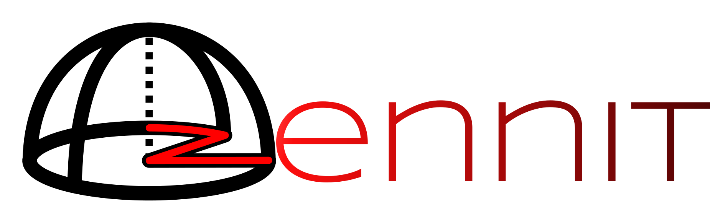
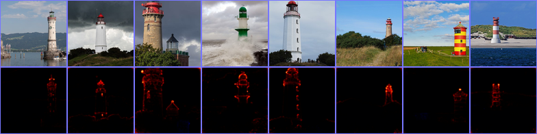
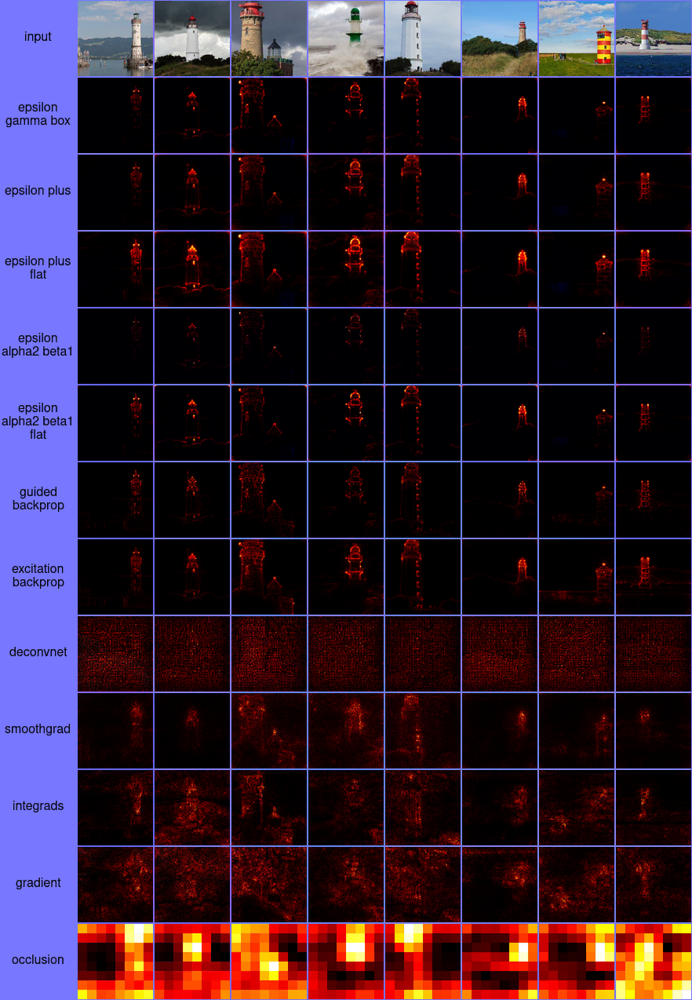
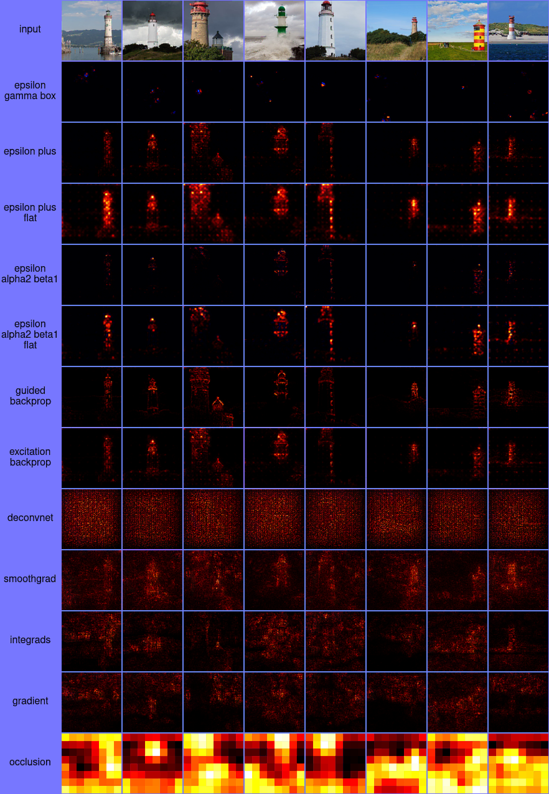

# Zennit


[](https://zennit.readthedocs.io/en/latest/?badge=latest)
[](https://github.com/chr5tphr/zennit/actions/workflows/tests.yml)
[](https://pypi.org/project/zennit/)
[](https://github.com/chr5tphr/zennit/blob/master/COPYING.LESSER)

Zennit (**Z**ennit **e**xplains **n**eural **n**etworks **i**n **t**orch) is a
high-level framework in Python using Pytorch for explaining/exploring neural
networks. Its design philosophy is intended to provide high customizability and
integration as a standardized solution for applying rule-based attribution
methods in research, with a strong focus on Layerwise Relevance Propagation
(LRP). Zennit strictly requires models to use Pytorch's `torch.nn.Module`
structure (including activation functions).

Zennit is currently under active development, but should be mostly stable.

If you find Zennit useful for your research, please consider citing our related
[paper](https://arxiv.org/abs/2106.13200):
```
@article{anders2021software,
      author  = {Anders, Christopher J. and
                 Neumann, David and
                 Samek, Wojciech and
                 Müller, Klaus-Robert and
                 Lapuschkin, Sebastian},
      title   = {Software for Dataset-wide XAI: From Local Explanations to Global Insights with {Zennit}, {CoRelAy}, and {ViRelAy}},
      journal = {CoRR},
      volume  = {abs/2106.13200},
      year    = {2021},
}
```

## Documentation
The latest documentation is hosted at
[zennit.readthedocs.io](https://zennit.readthedocs.io/en/latest/).

## Install

To install directly from PyPI using pip, use:
```shell
$ pip install zennit
```

Alternatively, install from a manually cloned repository to try out the examples:
```shell
$ git clone https://github.com/chr5tphr/zennit.git
$ pip install ./zennit
```

## Usage
At its heart, Zennit registers hooks at Pytorch's Module level, to modify the
backward pass to produce rule-based attributions like LRP (instead of the usual
gradient). All rules are implemented as hooks
([`zennit/rules.py`](src/zennit/rules.py)) and most use the LRP basis
`BasicHook` ([`zennit/core.py`](src/zennit/core.py)).

**Composites** ([`zennit/composites.py`](src/zennit/composites.py)) are a way
of choosing the right hook for the right layer. In addition to the abstract
**NameMapComposite**, which assigns hooks to layers by name, and
**LayerMapComposite**, which assigns hooks to layers based on their Type, there
exist explicit **Composites**, some of which are `EpsilonGammaBox` (`ZBox` in
input, `Epsilon` in dense, `Gamma` in convolutions) or `EpsilonPlus` (`Epsilon`
in dense, `ZPlus` in convolutions). All composites may be used by directly
importing from `zennit.composites`, or by using their snake-case name as key
for `zennit.composites.COMPOSITES`.

**Canonizers** ([`zennit/canonizers.py`](src/zennit/canonizers.py)) temporarily
transform models into a canonical form, if required, like
`SequentialMergeBatchNorm`, which automatically detects and merges BatchNorm
layers followed by linear layers in sequential networks, or
`AttributeCanonizer`, which temporarily overwrites attributes of applicable
modules, e.g. to handle the residual connection in ResNet-Bottleneck modules.

**Attributors** ([`zennit/attribution.py`](src/zennit/attribution.py)) directly
execute the necessary steps to apply certain attribution methods, like the
simple `Gradient`, `SmoothGrad` or `Occlusion`. An optional **Composite** may
be passed, which will be applied during the **Attributor**'s execution to
compute the modified gradient, or hybrid methods.

Using all of these components, an LRP-type attribution for VGG16 with
batch-norm layers with respect to label 0 may be computed using:

```python
import torch
from torchvision.models import vgg16_bn

from zennit.composites import EpsilonGammaBox
from zennit.canonizers import SequentialMergeBatchNorm
from zennit.attribution import Gradient


data = torch.randn(1, 3, 224, 224)
model = vgg16_bn()

canonizers = [SequentialMergeBatchNorm()]
composite = EpsilonGammaBox(low=-3., high=3., canonizers=canonizers)

with Gradient(model=model, composite=composite) as attributor:
    out, relevance = attributor(data, torch.eye(1000)[[0]])
```

A similar setup using [the example script](share/example/feed_forward.py)
produces the following attribution heatmaps:


For more details and examples, have a look at our
[**documentation**](https://zennit.readthedocs.io/en/latest/).

### More Example Heatmaps
More heatmaps of various attribution methods for VGG16 and ResNet50, all
generated using
[`share/example/feed_forward.py`](share/example/feed_forward.py), can be found
below.

<details>
  <summary>Heatmaps for VGG16</summary>

  
</details>

<details>
  <summary>Heatmaps for ResNet50</summary>

  
</details>

## Contributing
See [CONTRIBUTING.md](CONTRIBUTING.md) for detailed instructions on how to contribute.

## License
Zennit is licensed under the GNU LESSER GENERAL PUBLIC LICENSE VERSION 3 OR
LATER -- see the [LICENSE](LICENSE), [COPYING](COPYING) and
[COPYING.LESSER](COPYING.LESSER) files for details.
